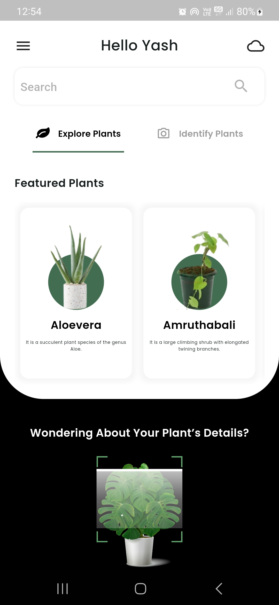
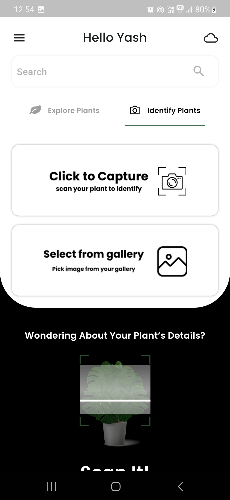
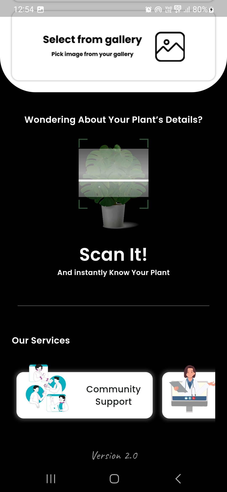
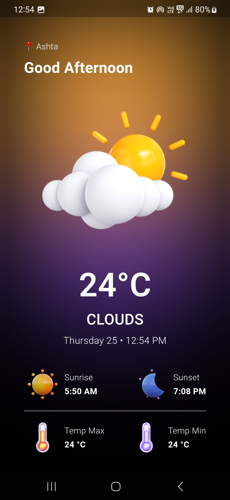
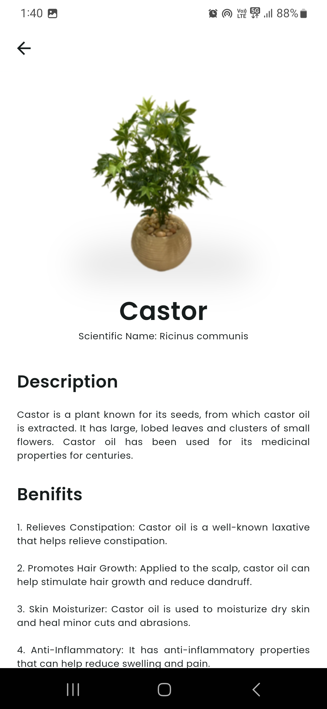
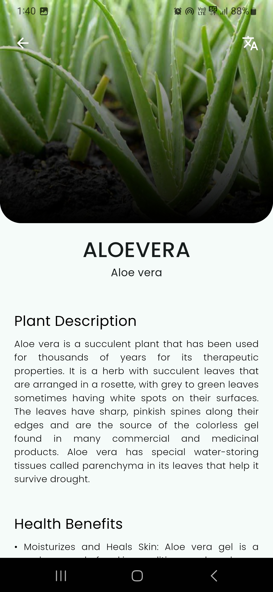

# Aayu - Medicinal Plant Identification App

**Version:** 2.0  
**Updated on:** 25/07/2024

Welcome to Aayu, your go-to app for identifying medicinal plants. With Aayu, you can effortlessly identify 10 classes of medicinal plants, connect with a vibrant community, and explore new plant discoveries shared by users.

## Table of Contents

- [Introduction](#introduction)
- [Unique Features](#unique-features)
- [Installation](#installation)
- [Usage](#usage)
- [Contributors](#contributors)
- [Screenshots](#screenshots)
- [Video Demo](#video-demo)
- [Download](#download)
- [License](#license)

## Introduction

Aayu is a powerful medicinal plant identification app designed to help you recognize and learn about various medicinal plants. This app is trained to identify 10 classes of medicinal plants:

- Aloevera
- Amruthabali
- Arali
- Castor
- Mango
- Mint
- Neem
- Sandalwood
- Turmeric

## Unique Features

### The Aayu Community

Explore a thriving community within Aayu where users can:

- **Discover and Share:** Upload and explore various plants and newly identified species.
- **Like and Comment:** Engage with posts by giving them a like or leaving comments with questions or suggestions.

## Installation

To install Aayu on your system, follow these steps:

1. **Clone the repository:**
   ```bash
   git clone https://github.com/Its-YashSoni/Aayu.git
   ```

2. **Navigate to the project directory:**
   ```bash
   cd Aayu
   ```

3. **Install dependencies:**
   ```bash
   flutter pub get
   ```

4. **Run the app:**
   ```bash
   flutter run
   ```

## Usage

Once you have the app installed, you can:

1. **Identify Plants:** Use the camera to capture images of plants and get instant identification results.
2. **Explore Community Posts:** Browse through posts shared by other users, like and comment on posts that interest you.
3. **Share Your Discoveries:** Upload pictures of medicinal plants you’ve discovered and contribute to the community.

## Screenshots

Here are some screenshots of Aayu in action:

<div style="display: flex; flex-wrap: wrap; gap: 10px;">
  
  
  
  
  
  
  
  
  
  
</div>

## Video Demo

Check out our video demo to see Aayu in action:

[](screenshots/screenrecording.gif)

## Contributors

We would like to extend our thanks to the following contributors:

<table>
  <tr>
    <td align="center"><a href="https://github.com/Its-YashSoni"><br /><sub><b>Yash Soni</b></sub></a></td>
    <td align="center"><a href="https://github.com/ayushdewang"><br /><sub><b>Ayush Dewang</b></sub></a></td>
    <td align="center"><a href="https://github.com/krishna-jhala"><br /><sub><b>Krishna Jhala</b></sub></a></td>
    <td align="center"><a href="https://github.com/Noshaba-khan"><br /><sub><b>Noshaba Khan</b></sub></a></td>
    <td align="center"><a href="https://github.com/ritesh6262"><br /><sub><b>Ritesh Bobade</b></sub></a></td>
    <td align="center"><a href="https://github.com/poojabaghel0604"><br /><sub><b>Pooja Baghel</b></sub></a></td>
  </tr>
</table>

## Download

You can download the Aayu app from the Google Play Store:

<div style="display: flex; flex-wrap: wrap; gap: 30px;">
<a href="#"></a>
<a href='https://indusapp.store/mnqcko3k'></a>
</div>

## License

This project is open to all for contributions. We only ask that you give us credit for the work.
